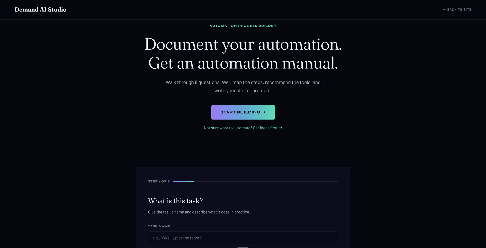

# Automation Process Builder

A free, open-source tool that helps anyone document an automation — even if they've never built one before.

Walk through 8 questions. Get a structured process playbook, tool recommendations per step, and starter AI prompts — all generated client-side, with zero latency.

**Want to try it first? [See it live →](https://automate.demandai.studio)**

**This repo is for deploying your own branded version** — for your team, your clients, or your audience. Follow the 5-step guide below to have your own copy running in minutes.



[](https://app.netlify.com/start/deploy?repository=https://github.com/c-b-g-m/automation-process-builder)

---

## What you'll need

- **GitHub account** (free) — the Deploy button forks this repo to your account automatically
- **Netlify account** (free) — to deploy the site
- **Supabase account** (free) — to log submissions

That's it. No code editor required.

---

## What It Does

1. **Idea generator** — Not sure what to automate? Answer 2 questions and get 3 role-based ideas to start from.
2. **8-step wizard** — Guides you through trigger, inputs, steps, outputs, success criteria, frequency, and failure cost. Flags vague answers inline so nothing slips through.
3. **Email gate** — Collects name + email before revealing output. Returning users skip the email gate automatically.
4. **Output section** — Process playbook card, per-step tool recommendations, collapsible starter AI prompts, and a next-steps checklist.
5. **Supabase logging** — Every submission is stored in your Supabase table for follow-up or analysis.

---

## Deploy in 5 Steps

### Step 1 — Deploy to Netlify

Click the **Deploy to Netlify** button above. It will:
- Fork this repo to your GitHub account
- Create a new Netlify site connected to that fork
- Deploy it immediately

No configuration needed to get the site running. You can customize afterward.

After deploying, find your forked repo at `github.com/[your-username]/automation-process-builder` — you'll need it in Step 3.

---

### Step 2 — Create the Supabase table

1. Go to [supabase.com](https://supabase.com) and create a free account if you don't have one.
2. Create a new project.
3. In the left sidebar, click **SQL Editor**.
4. Paste the SQL below into the editor and click **Run** in the top right:

```sql
create table automation_submissions (
  id          uuid primary key default gen_random_uuid(),
  created_at  timestamptz not null default now(),
  name        text,
  email       text not null,
  task_name   text,
  task_desc   text,
  trigger     text,
  inputs      text,
  steps       jsonb,
  output_desc text,
  destination text,
  success_criteria text,
  frequency   text,
  failure_cost text
);

alter table automation_submissions enable row level security;

create policy "anon insert only"
  on automation_submissions
  for insert
  to anon
  with check (true);
```

5. In your Supabase project, go to **Project Settings → API**.
6. Copy your **Project URL** and **anon public key**.

> The anon key is designed to be public — Supabase's row-level security policy (which you set up above) controls what anyone can do with it. It is safe to include in your code.

---

### Step 3 — Add your Supabase credentials

No code editor needed. Here's the fastest way:

1. Go to `github.com/[your-username]/automation-process-builder`
2. Click `index.html`
3. Click the pencil icon (Edit this file)
4. Use Ctrl+F / Cmd+F to find `REQUIRED`
5. Replace the two placeholder values
6. Click **Commit changes** — this saves the file to your repo and automatically triggers a Netlify redeploy. Wait 30–60 seconds, then check the **Deploys** tab in your Netlify dashboard to confirm it went live.

---

### Step 4 — Verify it's working

Once Netlify finishes deploying (check the **Deploys** tab in your dashboard):
1. Open your site URL (shown under **Site overview** in your Netlify dashboard)
2. Walk through the wizard once end-to-end
3. Submit the email gate
4. In Supabase, click **Table Editor** in the left sidebar → select `automation_submissions` — you should see a new row

If nothing appears in Supabase, double-check that your URL and anon key were saved correctly. The tool will still work either way — Supabase logging is non-blocking.

---

### Step 5 — (Optional) Add a custom domain

> Skip this step if you're fine using the Netlify URL (e.g., `quirky-fox-123.netlify.app`). You can always add a custom domain later.

In your Netlify site dashboard:
1. Go to **Domain management → Add custom domain**
2. Enter your subdomain (e.g., `automate.yourdomain.com`)
3. Add a CNAME record at your DNS provider pointing to your Netlify site URL
4. Netlify will provision an SSL certificate automatically

---

## Troubleshooting

**Submissions aren't appearing in Supabase**
Double-check that you copied the full Project URL (starts with `https://`) and the full anon key — even one missing character will silently fail. The tool will continue to work either way; submissions just won't be logged.

**Netlify deploy is stuck or showing an error**
Go to your Netlify site dashboard → **Deploys** tab and click the failed deploy to see the error log. The most common cause is an incomplete GitHub connection during setup. Try the Deploy to Netlify button again.

**I can't find my forked repo on GitHub**
Go to `github.com/[your-username]` and look under **Repositories**. It will be named `automation-process-builder`.

**My site URL looks random (e.g., `quirky-fox-123.netlify.app`)**
That's normal — Netlify assigns a random name by default. You can rename it under **Site configuration → Site name**, or connect a custom domain in Step 5.

**Still stuck?**
Open a [GitHub Issue](https://github.com/c-b-g-m/automation-process-builder/issues) and describe what happened. I check regularly.

---

## Customization

### Brand name and links
Search `index.html` for `<!-- CUSTOMIZE:` — every brand-specific element has a comment marking it. There are 4 spots:
- Page title and meta description (lines 6–8)
- Nav logo and "Back to site" link (~line 1053)
- Footer CTA (~line 1484)
- Page footer copyright (~line 1501)

### Colors and fonts
All CSS variables are defined at the top of the `<style>` block:
```css
:root {
  --bg: #06060F;
  --violet: #A07AFF;
  --teal: #00DCB4;
  --cream: #EEF0FF;
  --aurora: linear-gradient(90deg, #A07AFF 0%, #00DCB4 100%);
  /* ... */
}
```
Change these to match your brand.

### Question flow
The 8 wizard questions are in the `<!-- ── Wizard ── -->` section of `index.html`. Each step has a `<div class="wizard-step" data-step="N">` wrapper. Edit the `<label>` text and `<textarea>` placeholder to change what questions are asked.

### Tool recommendation logic
The rule-based tool recommendation engine is in the `getToolsForStep()` function in the `<script>` block. It maps keyword patterns + judgment level + trigger type to tool suggestions. Edit the `TOOL_MAP` object to change which tools are recommended.

### Idea generator content
The 21 pre-loaded ideas (3 per role) are in the `IDEAS` object in the `<script>` block. Edit or extend them to fit your audience.

---

## Architecture

- **Single static HTML file** — no framework, no build step, no dependencies beyond Google Fonts and Supabase CDN
- **Zero API calls for output generation** — all tool recommendations and prompt templates are rule-based and run client-side
- **Supabase** (optional) — one table, anon insert only, RLS enabled. If credentials are missing or wrong, the tool still works; submissions just won't be logged
- **localStorage** — used only to detect returning users and skip the email gate

---

## License

MIT — fork it, customize it, deploy it. Attribution appreciated but not required.
